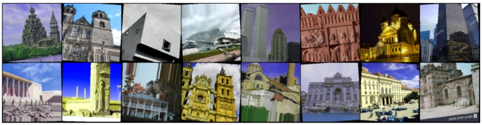
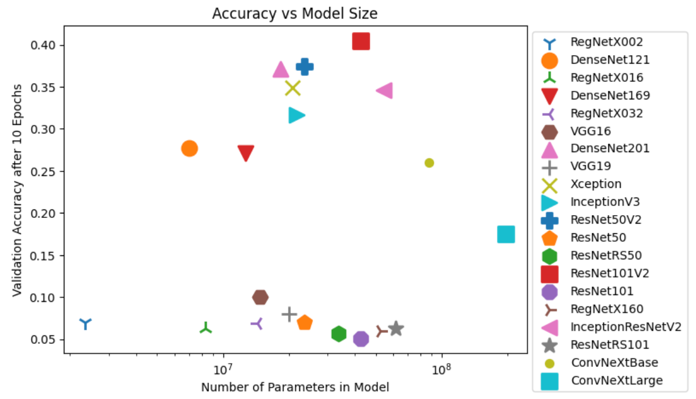
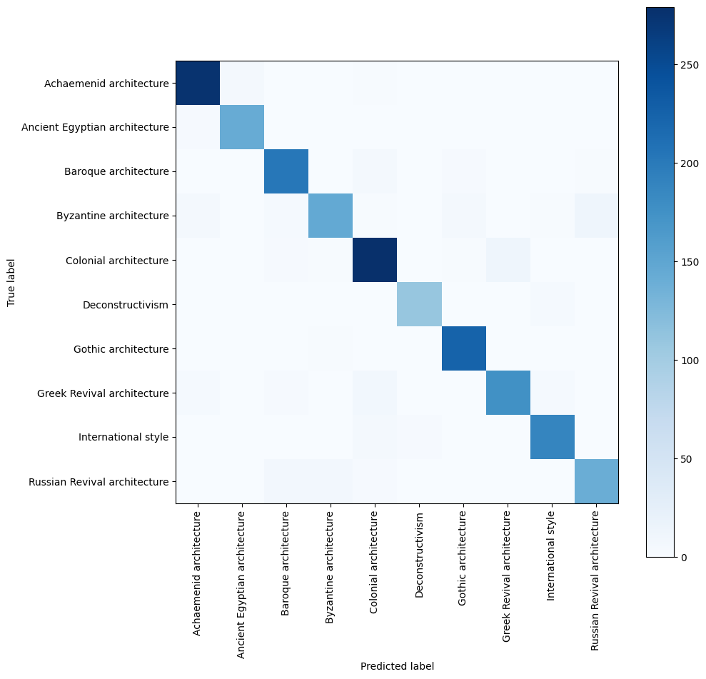

<br/>
<p align="center">
  <a href="https://github.com/ChengaFEI/cnn-driven-architecture-style-classifier">
    
  </a>

  <h3 align="center">Archtecture Style Classifier</h3>

  <p align="center">
    Convolutional-Neural-Network Implementation Project
    <br/>
    <br/>
    <a href="https://github.com/ChengaFEI/cnn-driven-architecture-style-classifier/issues">Report Bug</a>
    .
    <a href="https://github.com/ChengaFEI/cnn-driven-architecture-style-classifier/issues">Request Feature</a>
  </p>
</p>

<!--  -->

    

## Table Of Contents

- [Table Of Contents](#table-of-contents)
- [About The Project](#about-the-project)
  - [Overview](#overview)
  - [Model Selection](#model-selection)
  - [Confusion Matrix](#confusion-matrix)
- [Project Structure](#project-structure)
- [Built With](#built-with)
- [Getting Started](#getting-started)
  - [Dataset](#dataset)
  - [Prerequisites](#prerequisites)
  - [Installation](#installation)
- [Usage](#usage)
- [Roadmap](#roadmap)
- [Contributing](#contributing)
  - [Creating A Pull Request](#creating-a-pull-request)
- [License](#license)
- [Authors](#authors)
- [Acknowledgements](#acknowledgements)

## About The Project



### Overview

This project introduces a novel architecture style classification model aimed at discerning various architectural styles based on their visual characteristics. As individuals explore new environments, encountering buildings of historical or unique significance often sparks curiosity about their architectural styles and the narratives they encapsulate. However, recognizing and cataloging diverse architectural styles can be challenging for humans due to their sheer abundance and complexity. In response to this challenge, our study proposes the development of an architecture style classification model capable of real-time recognition. This model holds promising applications, particularly for tourists who can capture images of buildings and promptly identify their architectural styles. The primary objective is to create a system adept at recognizing architectural styles across different historical eras and various architects' designs. By employing advanced visual recognition techniques, our model aims to contribute to the seamless integration of technology into architectural appreciation, providing an accessible tool for enthusiasts, historians, and tourists alike. The potential impact of such a model extends beyond individual curiosity, offering a practical solution for instant architectural style identification in diverse scenarios.

### Model Selection



To identify the most suitable CNN architecture for classifying architectural images, we conducted a thorough evaluation of various Convolutional Neural Network (CNN) architectures to determine the most suitable model for classifying architectural images in our initial phase of research. This evaluation encompassed a diverse range of CNN models, including well-known architectures such as VGG, Inception, and ResNet. Each of these models was assessed for their potential effectiveness in our specific application. Ultimately, the ResNet architecture was selected for its advanced residual learning framework. This framework is particularly beneficial as it effectively combats the vanishing gradient problem that often plagues deep neural networks, ensuring consistent learning even as the network depth increases. The selection criteria were not solely based on architectural features; we also considered critical performance metrics. These included the accuracy of the model and the speed of convergence during preliminary testing. Another key factor in our decision was the model's ability to handle deep architectures without significant performance degradation. ResNet's capability to maintain robust performance in deep network structures, without losing efficiency or accuracy, made it the standout choice for our complex image classification task.

### Confusion Matrix



A suite of metrics was employed to provide a holistic view of the model's performance. These included accuracy, which measures the proportion of correctly predicted instances; precision, indicating the proportion of positive identifications that were actually correct; recall, reflecting the proportion of actual positives that were correctly identified; and the F1 score, which provides a balance between precision and recall. These metrics together offered a comprehensive understanding of the model's strengths and areas for improvement, giving us a detailed picture of its overall effectiveness in classifying architectural styles. In our experiment, the F1 score is 0.93, the recall is 0.93, and the precision is 0.93. These key metrics prove that our model is good enough to identify the correct architecture labels in the picture.

## Project Structure

```sh
.
├── LICENSE.md
├── README.md
├── data  # Dataset
│   ├── dataset-lite-augumented  # Put downloaded dataset here
│   └── download.txt  # Follow the instructions to download the dataset
├── images  # Images for README.md
│   ├── logo.png
│   └── screenshot.jpg
├── models  # Trained models
│   ├── custom.ipynb  # Custom model
│   └── transfer.ipynb  # Transfer learning model
├── reports  # Project reports
│   ├── architectural-style-classification.pdf  # Final report
│   ├── docs
│   │   ├── milestone.docx  # Milestone report
│   │   ├── milestone.pdf
│   │   ├── proposal.docx  # Project proposal
│   │   └── proposal.pdf
│   └── latex  # Latex source files
└── utils  # Utils for data processing
    ├── augment-data.ipynb  # Utils for data augmentation
    └── visualize-data.ipynb  # Utils for data visualization
```

## Built With

- `Python`
- `PyTorch`

## Getting Started

### Dataset

1. Augumented Dataset

   - You can download the dataset from the [link](https://drive.google.com/file/d/1Yt9CG-i1Ktt5NevSWfNTlQtQDt8PPyJR/view?usp=drive_link)
   - Unzip the file and rename the folder to `data/dataset-lite-augumented`

2. Raw Dataset

   - You can also find the raw data from the [link](https://drive.google.com/file/d/13_szSJ_DuF98blFr58l8hNftC2lXeWy1/view?usp=drive_link)

### Prerequisites

1. Jupyter Notebook

   - Install the classic Jupyter Notebook with:

     ```sh
     pip install notebook
     ```

   - To run the notebook:

     ```sh
     jupyter notebook
     ```

1. PyTorch

   - Install PyTorch with:

     ```sh
     pip install torch torchvision
     ```

### Installation

1. Clone the repo

   ```sh
   git clone https://github.com/ChengaFEI/cnn-driven-architecture-style-classifier.git
   ```

2. Create a [virtual environment](https://conda.io/projects/conda/en/latest/user-guide/tasks/manage-environments.html#activating-an-environment)

3. Install the [IPython kernel](https://ipython.readthedocs.io/en/stable/install/kernel_install.html)

4. Run the notebook

   ```sh
   jupyter notebook
   ```

## Usage

The notebook is self-explanatory. You can run the cells one by one to see the results.

## Roadmap

See the [open issues](https://github.com/ChengaFEI/cnn-driven-architecture-style-classifier/issues) for a list of proposed features (and known issues).

## Contributing

Contributions are what make the open source community such an amazing place to be learn, inspire, and create. Any contributions you make are **greatly appreciated**.

- If you have suggestions for adding or removing projects, feel free to [open an issue](https://github.com/ChengaFEI/cnn-driven-architecture-style-classifier/issues/new) to discuss it, or directly create a pull request after you edit the _README.md_ file with necessary changes.
- Please make sure you check your spelling and grammar.
- Create individual PR for each suggestion.
- Please also read through the [Code Of Conduct](https://github.com/ChengaFEI/cnn-driven-architecture-style-classifier/blob/main/CODE_OF_CONDUCT.md) before posting your first idea as well.

### Creating A Pull Request

1. Fork the Project
2. Create your Feature Branch (`git checkout -b feature/AmazingFeature`)
3. Commit your Changes (`git commit -m 'Add some AmazingFeature'`)
4. Push to the Branch (`git push origin feature/AmazingFeature`)
5. Open a Pull Request

## License

Distributed under the MIT License. See [LICENSE](https://github.com/ChengaFEI/cnn-driven-architecture-style-classifier/blob/main/LICENSE.md) for more information.

## Authors

- **Cheng Fei** - _MEng CS student_ - [Cheng Fei](https://github.com/ChengaFEI) - _Built the project_
- **David Lou** - _MEng CS student_ - [David Lou](https://github.com/AlphaWhiskyLou) - _Built the project_
- **Wenjie Wang** - _MEng CS student_ - [Wenjie Wang](https://github.com/WenjieWangX) - _Built the project_

## Acknowledgements
